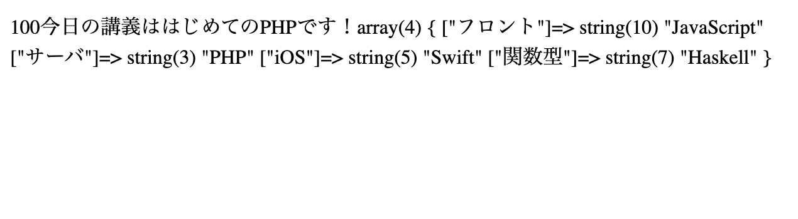
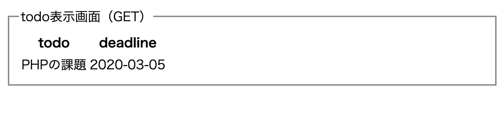
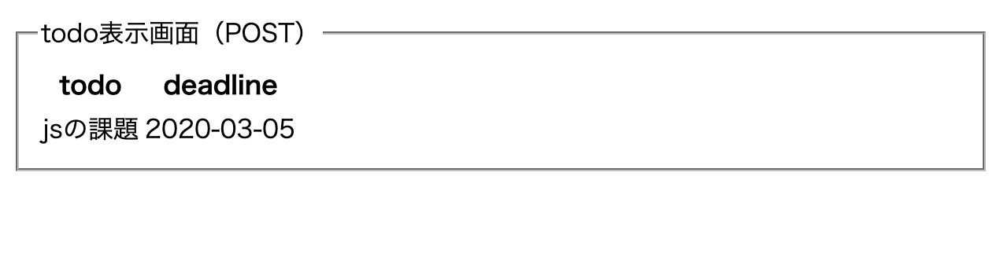
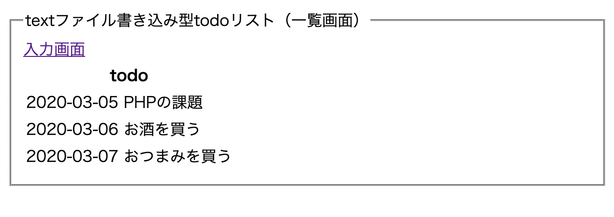

# PHP day1

- PHP基礎．
- データ送受信の基礎．
- textファイル書き込み型todoリストの実装.

## 本日のゴール
- PHPの開発に慣れる．
- クライアント-サーバ間で実行されるデータ送受信を理解する．
- ファイル書き込み操作を実装し，入力データをサーバ上のファイルに保存できるようにする．

## 0. contents
1. PHPの基礎（変数，配列，条件分岐など）
2. `GET`，`POST`を用いたデータ通信
3. textファイル書き込み型todoリストの実装

## 1. PHPの基礎（変数，配列，条件分岐など）

### 1.1 ゴール
- 変数の定義と出力ができる．
- 配列の定義と出力ができる．
- 条件分岐を用いておみくじを実装する．

### 1.2 やること
- 変数を定義して値を代入し，出力．
- 配列を定義して値を代入し，出力．
- 乱数を発生させ，乱数の値によって大吉-大凶をブラウザに表示する．

### 1.3 必要な実装
#### 変数の定義と出力
- 変数を定義して値を代入する．
```php
// index.php
// 変数の定義は$必須
// 行末には「;」必須
$number = 100;
$str = "はじめてのPHP";

// 数値始まりはNG
// $1test = 10;
```

- 値を出力する．
```php
// index.php
// echoで出力できる
echo $number;
```

- 文字列と変数を組み合わせる．
```php
// index.php
// 文字列と変数の組み合わせ
echo  "今日の講義は{$str}です！";
```

#### 配列の定義と出力
- 配列を定義する．
```php
// index.php
// $array[0]などで取得可能
$array1 = ["JavaScript", "PHP", "Swift", "Haskell"];

// キー名を指定することもできる（jsのオブジェクト的な感じ）
// $array2["サーバ"]などで取得可能
$array2 = [
  "フロント" => "JavaScript",
  "サーバ" => "PHP",
  "iOS" => "Swift",
  "関数型" => "Haskell"
];
```

- 配列の構造なども含めて表示する場合には`var_dump()`関数を使用する．
- **今後多用する．**

```php
// index.php
// 変数や配列のデータを出力できる`var_dump()`関数
var_dump($array2);
```

#### おみくじの実装
- `mt_rand()`関数を用いてランダムな数を発生させる．

```php
// omikuji.php
// 乱数の生成
// 最小値と最大値を設定する
$num = mt_rand(1, 5);
```

- 条件分岐で結果を決める．

```php
// omikuji.php
// ...
// 条件分岐
if ($num == 1) {
  $result = "大吉";
} else if ($num == 2) {
  $result = "中吉";
} else if ($num == 3) {
  $result = "小吉";
} else if ($num == 4) {
  $result = "凶";
} else if ($num == 5) {
  $result = "大凶";
} else {
  $result = "エラー";
}

// 適宜結果をチェック
// var_dump($result);
```

- 表示用のhtmlコンテンツを追加
- htmlファイルと同様に`「! -> tab」`でテンプレートを作成できる．
- htmlの中にPHPの変数を埋め込みたい場合は`<?=変数名?>`で実現できる．
- htmlと組み合わせるときはPHPタグを省略しないこと（PHPとhtmlの区別がつかなくなるため）


```php
// omikuji.php
// ...
?>

<!DOCTYPE html>
<html lang="ja">

<head>
  <meta charset="UTF-8">
  <meta name="viewport" content="width=device-width, initial-scale=1.0">
  <title>PHPおみくじ</title>
</head>

<body>
  <h1>今日のPHP運は<?= $result ?>です！</h1>
</body>

</html>
```

### 1.4 動作確認

#### 変数と配列の動作確認
- 下記の画像では全部出力しているので続けて表示される．
- 個別に出力するとわかりやすい．



#### おみくじの動作確認
- 再読み込みするごとにおみくじを引き直すので結果が変化する．


## 2. `GET`，`POST`を用いたデータ通信

### 2.1 ゴール
- ブラウザ上でフォームに入力したデータをサーバに送信する．
- 受信側のファイルでは，送信データを受け取り，htmlに埋め込む．
- 2種類の送信方法`GET`と`POST`を理解する．

### 2.2 やること
- 入力フォームにデータの送信先を設定する．
- 入力フォームにデータの送信方法を設定する．
- 入力フォームにデータの名前を設定する．
- 受け取り側のファイルで情報を受け取る．
- 受け取り側のファイルで受け取った情報をブラウザに表示する．

### 2.3 必要な実装
#### `GET`でのデータ通信（送信側 / `todo_get.php`）

- `form`タグに`action`属性を追加し，送信先のファイル（`todo_get_confirm.php`）を指定する．
- `form`タグに`method`属性を追加し，送信方法（`GET`か`POST`）を指定する．今回は`GET`で送信する．
- それぞれの`input`タグに`name`属性を追加し，送信するデータの名前を指定する．今回は`todo`と`deadline`にする．

```html
<!-- todo_get.php -->
<!-- ... -->
  <!-- formにはaction, method, nameを設定！ -->
  <form action="todo_get_confirm.php" method="GET">
    <fieldset>
      <legend>todo登録画面（GET）</legend>
      <div>
        todo: <input type="text" name="todo">
      </div>
      <div>
        deadline: <input type="date" name="deadline">
      </div>
      <div>
        <button>submit</button>
      </div>
    </fieldset>
  </form>
  <!-- ... -->
```

#### `GET`でのデータ通信（受信側 / `todo_get_confirm.php`）
- `$_GET`で送信されてきたデータを受け取る．
- （var_dump()を用いて受け取れていることを確認する）
- 送信側の`input`に設定した`name`属性の値を用いてデータを取り出す．

```php
// todo_get_confirm.php
// まずデータの受取を確認
// var_dump($_GET);
// exit();
// ↑exit()関数は以降の処理を中止する関数

// name属性の値を指定してデータを受け取る
$todo = $_GET["todo"];
$deadline = $_GET["deadline"];

// 上記の変数をhtmlに埋め込んで表示する

?>
```

- ブラウザに各データを表示する．

```html
  <tbody>
    <tr>
      <td><?= $todo ?></td>
      <td><?= $deadline ?></td>
    </tr>
  </tbody>
```

#### `POST`でのデータ通信（送信側 / `todo_post.php`）

- `form`タグに`action`属性を追加し，送信先のファイル（`todo_post_confirm.php`）を指定する．
- `form`タグの`method`属性を`POST`にする．
- それぞれの`input`タグに`name`属性を追加し，送信するデータの名前を指定する．今回は`todo`と`deadline`にする．

```html
<!-- todo_post.php -->
<!-- ... -->
  <!-- formにはaction, method, nameを設定！ -->
  <form action="todo_post_confirm.php" method="POST">
    <fieldset>
      <legend>todo登録画面（POST）</legend>
      <div>
        todo: <input type="text" name="todo">
      </div>
      <div>
        deadline: <input type="date" name="deadline">
      </div>
      <div>
        <button>submit</button>
      </div>
    </fieldset>
  </form>
  <!-- ... -->
```

#### `POST`でのデータ通信（受信側 / `todo_post_confirm.php`）
- `$_POST`で送信されてきたデータを受け取る．
- （var_dump()を用いて受け取れていることを確認する）
- 送信側の`input`に設定した`name`属性の値を用いてデータを取り出す．

```php
// todo_post_confirm.php
// まずデータの受取を確認
// var_dump($_POST);
// exit();
// ↑exit()関数は以降の処理を中止する関数

// name属性の値を指定してデータを受け取る
$todo = $_POST["todo"];
$deadline = $_POST["deadline"];

// 上記の変数をhtmlに埋め込んで表示する

?>
```

- ブラウザに各データ（`$todo`, `$deadline`）を表示する．

```html
  <tbody>
    <tr>
      <td><?= $todo ?></td>
      <td><?= $deadline ?></td>
    </tr>
  </tbody>
```

### 2.4 動作確認

#### `GET`でのデータ送受信
- `todo_get.php`の`form`に情報を入力して`submit`をクリックすると，自動的に`todo_get_coonfirm.php`に入力したデータが表示される．



- `GET`を用いているので，urlに入力データが追加されている点に注目．


#### `POST`でのデータ送受信
- `todo_post.php`の`form`に情報を入力して`submit`をクリックすると，自動的に`todo_post_coonfirm.php`に入力したデータが表示される．



- `POST`を用いているので，urlには変化がない．


## 3. textファイル書き込み型todoリストの実装

### 3.1 ゴール
- ブラウザ上でフォームに入力したデータをサーバに送信する．
- 受信側のファイルでは，送信データを受け取り，txtファイルに書き込む．
- 送信されたデータがtxtファイルに保存されている状態．

### 3.2 やること
#### 送信側ファイル（`todo_txt_input.php`）
- 入力フォームにデータの送信先を設定する．
- 入力フォームにデータの送信方法を設定する．
- 入力フォームにデータの名前を設定する．

#### 受け取り側ファイル（`todo_txt_create.php`）
- `POST`で情報を受け取る．
- 受け取った情報をtxtファイルに書き込む．
- 書き込みが終わったら送信側ファイルを読み込む．

#### 読み取り側ファイル（`todo_txt_read.php`）
- 実行時，txtファイルを開き，内容を読み込む．
- 読み込んだデータをブラウザで表示するために整形する．
- htmlに埋め込み，ブラウザで表示する．

### 3.3 必要な実装

#### 送信側ファイル（`todo_txt_input.php`）
- `form`タグに`action`属性を追加し，送信先のファイル（`todo_txt_create.php`）を指定する．
- `form`タグの`method`属性を`POST`にする．
- それぞれの`input`タグに`name`属性を追加し，送信するデータの名前を指定する．今回は`todo`と`deadline`にする．

```html
<!-- todo_txt_input.php -->
<!-- ... -->
  <form action="todo_txt_create.php" method="POST">
    <fieldset>
      <legend>textファイル書き込み型todoリスト（入力画面）</legend>
      <a href="todo_txt_read.php">一覧画面</a>
      <div>
        todo: <input type="text" name="todo">
      </div>
      <div>
        deadline: <input type="date" name="deadline">
      </div>
      <div>
        <button>submit</button>
      </div>
    </fieldset>
  </form>
```

#### 受信側ファイル（`todo_txt_create.php`）
- `$_POST`で送信されてきたデータを受け取る．
- （var_dump()を用いて受け取れていることを確認する）
- 送信側の`input`に設定した`name`属性の値を用いてデータを取り出す．
- 書き込みしやすいようにデータをまとめる．
- txtファイルを開く．
- （txtファイルは存在しなければ新規作成される．`ab`オプションで開いているため．）
- 開いたファイルをロックする．
- データを書き込む．
- ロックを解除する．
- 書き込みに成功したら入力画面のファイル（`todo_txt_input.php`）に移動する．

```php
// todo_txt_create.php
// まずは送信データのチェック
// var_dump($_POST);
// exit();
$todo = $_POST["todo"];
$deadline = $_POST["deadline"];
// 書き込みデータの作成（スペース区切りで最後に改行コードを追加）
$write_data = "{$deadline} {$todo}\n";
// 書き込みたいファイル名を指定
$file_name = "data/todo.txt";
// ファイルを開く処理
$file = new SplFileObject($file_name, "ab");
// ファイルロックの処理
$file->flock(LOCK_EX);
// ファイル書き込み処理
$written = $file->fwrite($write_data);
// ファイルアンロックの処理
$file->flock(LOCK_UN);
// 結果によって条件分岐
if ($written === FALSE) {
  // エラー表示
  echo "エラー！！";
} else {
  // 入力画面へ移動
  header("Location:todo_txt_input.php");
}

// txtファイルへの書き込みのみ行うので表示する画面は存在しない
```

#### 読み込み側ファイル（`todo_txt_read.php`）
- txtファイルを開く（`data/todo.txt`）．
- ファイルをロックする．
- データを読み込んでタグを付加しつつ配列に格納する．
- ファイルのロックを解除する．

```php
// todo_txt_read.php
// 読み込みたいファイル名を指定
$file_name = "data/todo.txt";
// ファイルを開く処理
$file = new SplFileObject($file_name, "rb");
// ファイルロックの処理
$file->flock(LOCK_EX);
// 出力用の文字列（ここに読み込んだデータをタグに入れた形式で追加していく）
$str = "";
// ファイル書き込み処理
// 1行づつ取り出す
foreach ($file as $row) {
  // 出力用の文字列に追加
  $str .= "<tr><td>{$row}</td></tr>";
}
// ファイルアンロックの処理
$file->flock(LOCK_UN);
```

- 配列の中身（タグに入ったデータ / `$str`）をブラウザに表示する．

```html
  <table>
    <thead>
      <tr>
        <th>todo</th>
      </tr>
    </thead>
    <tbody>
      <?= $str ?>
    </tbody>
  </table>
```

### 3.4 動作確認

- 入力画面で入力して送信すると`data/todo.txt`にデータが書き込まれている．

- 書き込み後，一覧画面を表示するとtxtファイルの中身が表示されている状態であればOK．



今回はここまで( `･ω･)b

### チャレンジ！
- ラジオボタンで入力
- チェックボックスで入力
- データをグラフ表示
- 取得したデータを分析して結果を表示
- 画面デザイン

### 次回
- データ保存専用機能（DB）の使用
- データ登録処理，読み込み処理
