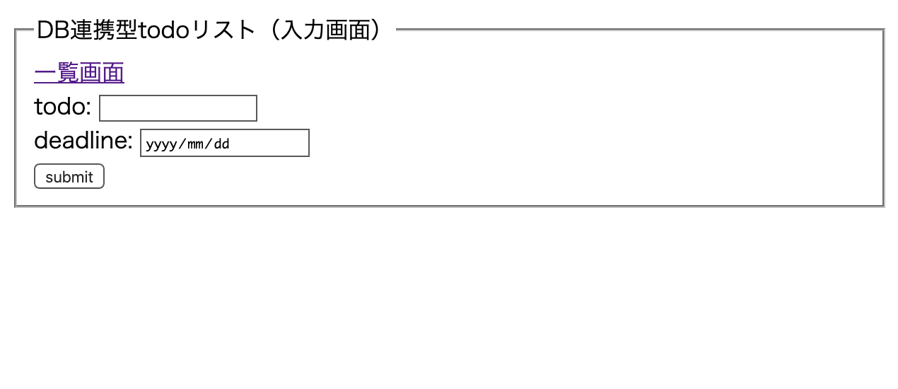
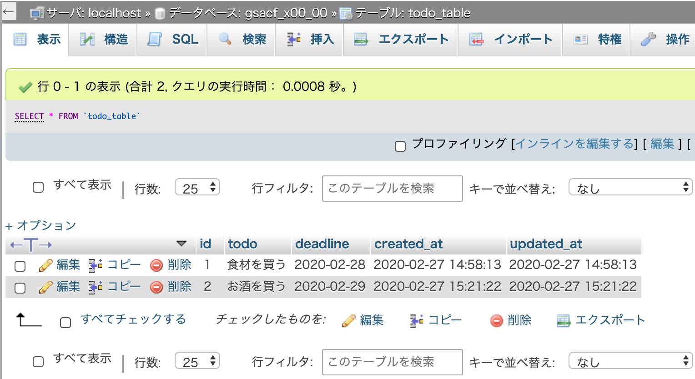
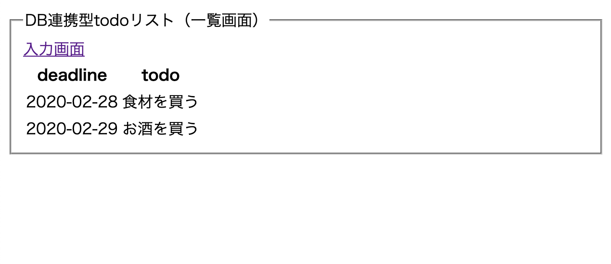

# PHP day2

- DB連携型todoリストの実装（新規データの登録 / 登録済みデータの取得）

## 本日のゴール

- 入力画面で入力した値がDBに保存できる．
- DBに保存したデータを一覧画面に表示できる．

## 0. contents
1. 入力画面の実装（`todo_input.php`）
2. 新規データ登録処理の実装（`todo_create.php`）
3. 登録済みデータ取得処理の実装（`todo_read.php`）

## 1. 入力画面の実装

### 1.1 ゴール
- ブラウザに入力画面を表示する．
- 入力項目は`todo`と`deadline`の2項目．
- ブラウザ画面上から入力し，`submit`ボタンクリックでDB登録を実行するファイルにデータを送信する．

### 1.2 やること
- 入力フォームにデータの送信先を設定する．
- 入力フォームにデータの送信方法を設定する．
- 入力フォームにデータの名前を設定する．

※名前を設定しないと送信先でデータを識別できないため正しく処理が実行されない．

### 1.3 必要な実装
- `form`タグに`action`属性を追加し，送信先のファイルを指定する．
- `form`タグに`method`属性を追加し，送信方法（`GET`か`POST`）を指定する．今回は`POST`で送信する．
- それぞれの`input`タグに`name`属性を追加し，送信するデータの名前を指定する．今回は`todo`と`deadline`にする．

`todo_input.php`の`form`タグ内を以下のように編集する．
```html
<!--todo_input.php-->
  <form action="todo_create.php" method="POST">
    <fieldset>
      <legend>DB連携型todoリスト（入力画面）</legend>
      <a href="todo_read.php">一覧画面</a>
      <div>
        todo: <input type="text" name="todo">
      </div>
      <div>
        deadline: <input type="date" name="deadline">
      </div>
      <div>
        <button>submit</button>
      </div>
    </fieldset>
  </form>
```

### 1.4 動作確認

- 現状ではブラウザで読み込んだときに問題なく表示されればOK．



## 2. 新規データ登録処理の実装

### 2.1 ゴール
- `todo_input.php`から送信されてきたデータを受け取り，DBへ登録する．
- `phpmyadmin`で確認し，`todo_input.php`で入力したデータが`todo_table`に保存されている状態．

### 2.2 やること
- データが入力されているかどうかを確認し，問題なければ送信されてきたデータを受け取る．
- DBに接続する．
- データを登録する．
- 登録がうまく行った場合は再度入力ページを表示する．

### 2.3 必要な実装
- `$_POST`で`todo`と`deadline`が送信されていない，または空で送信されてきた場合はエラーを出力し，以降の処理を中止する．
- エラーでなければ送信されてきたデータを扱いやすいよう変数に入れる．

```php
// todo_create.php
// ...
// 項目入力のチェック
// 値が存在しないor空で送信されてきた場合はNGにする
if (
  !isset($_POST['todo']) || $_POST['todo'] == '' ||
  !isset($_POST['deadline']) || $_POST['deadline'] == ''
) {
  // 項目が入力されていない場合はここでエラーを出力し，以降の処理を中止する
  echo json_encode(["error_msg" => "no input"]);
  exit();
}

// 受け取ったデータを変数に入れる
$todo = $_POST['todo'];
$deadline = $_POST['deadline'];

// ...
```

- DB接続に使用する設定（DB情報，ユーザ名，パスワード）を記述．
- DB接続処理を実行する．
- 接続に失敗した場合はエラーを出力し，以降の処理を中止する．

```php
// todo_create.php
// ...
// DB接続の設定
// DB名は`gsacf_x00_00`にする
$dbn = 'mysql:dbname=gsacf_x00_00;charset=utf8;port=3306;host=localhost';
$user = 'root';
$pwd = '';

try {
  // ここでDB接続処理を実行する
  $pdo = new PDO($dbn, $user, $pwd);
} catch (PDOException $e) {
  // DB接続に失敗した場合はここでエラーを出力し，以降の処理を中止する
  echo json_encode(["db error" => "{$e->getMessage()}"]);
  exit();
}
// ...
```

- データを登録するためのSQL文を作成する．
- 必要なデータをバインド変数に設定する．
- SQL文を実行する．

```php
// todo_create.php
// ...
// データ登録SQL作成
// `created_at`と`updated_at`には実行時の`sysdate()`関数を用いて実行時の日時を入力する
$sql = 'INSERT INTO todo_table(id, todo, deadline, created_at, updated_at) VALUES(NULL, :todo, :deadline, sysdate(), sysdate())';

// SQL準備&実行
$stmt = $pdo->prepare($sql);
$stmt->bindValue(':todo', $todo, PDO::PARAM_STR);
$stmt->bindValue(':deadline', $deadline, PDO::PARAM_STR);
$status = $stmt->execute();
// ...
```

- SQL文の実行で失敗した場合はエラーメッセージを出力し，以降の処理を中止する．
- 実行に成功した場合は，入力ページファイル（`todo_input.php`）に移動し，処理を実行する．

```php
// todo_create.php
// ...
// データ登録処理後
if ($status == false) {
  // SQL実行に失敗した場合はここでエラーを出力し，以降の処理を中止する
  $error = $stmt->errorInfo();
  echo json_encode(["error_msg" => "{$error[2]}"]);
  exit();
} else {
  // 正常にSQLが実行された場合は入力ページファイルに移動し，入力ページの処理を実行する
  header("Location:todo_input.php");
  exit();
}
```

### 2.4 動作確認
- `phpmyadmin`で`todo_table`の内容を表示し，入力した内容が登録されていればOK．
- 表示タブをクリックすると最新の情報を表示できる．




## 3. 登録済みデータ取得処理の実装

### 3.1 ゴール
- 一覧画面（`todo_read.php`）にDBに保存されているデータが一覧で表示される．

### 3.2 やること
- DBに接続する．
- `todo_table`に保存されているデータを取得する．
- 取得したデータをタグに入れ，出力用の文字列を作成する．
- 作成した文字列をhtml要素に埋め込み，ブラウザに表示する．

### 3.3 必要な実装
- DBに接続する（`todo_create.php`と同様）．

```php
// todo_read.php
// ...
// DB接続の設定
// DB名は`gsacf_x00_00`にする
$dbn = 'mysql:dbname=gsacf_x00_00;charset=utf8;port=3306;host=localhost';
$user = 'root';
$pwd = '';

try {
  // ここでDB接続処理を実行する
  $pdo = new PDO($dbn, $user, $pwd);
} catch (PDOException $e) {
  // DB接続に失敗した場合はここでエラーを出力し，以降の処理を中止する
  echo json_encode(["db error" => "{$e->getMessage()}"]);
  exit();
}
// ...
```

- `todo_table`からデータを取得するSQL文を作成し，実行する．

```php
// todo_read.php
// ...
// データ取得SQL作成
$sql = 'SELECT * FROM todo_table';

// SQL準備&実行
$stmt = $pdo->prepare($sql);
$status = $stmt->execute();
// ...
```

- `$stmt->errorInfo()`でSQLの実行結果からレコードのデータを取得する（配列の形式で取得できる）．
- 配列に対してforeachを使用し，htmlで表示するためのタグに入れた文字列を生成する．

```php
// データ登録処理後
if ($status == false) {
  // SQL実行に失敗した場合はここでエラーを出力し，以降の処理を中止する
  $error = $stmt->errorInfo();
  echo json_encode(["error_msg" => "{$error[2]}"]);
  exit();
} else {
  // 正常にSQLが実行された場合は入力ページファイルに移動し，入力ページの処理を実行する
  // fetchAll()関数でSQLで取得したレコードを配列で取得できる
  $result = $stmt->fetchAll(PDO::FETCH_ASSOC);
  // データの出力用変数（初期値は空文字）を設定
  $output = "";
  // <tr><td>deadline</td><td>todo</td><tr>の形になるようにforeachで順番に$outputへデータを追加
  // `.=`は後ろに文字列を追加する，の意味
  foreach ($result as $record) {
    $output .= "<tr>";
    $output .= "<td>{$record["deadline"]}</td>";
    $output .= "<td>{$record["todo"]}</td>";
    $output .= "</tr>";
  }
  // $valueの参照を解除する．解除しないと，再度foreachした場合に最初からループしない
  // 今回は以降foreachしないので影響なし
  unset($value);
}
```

- ブラウザで表示するため，上で作成した文字列（`$output`）を適当な場所に埋め込み，htmlを完成させる．

```html
<!-- todo_read.php -->
<!-- ... -->
    <table>
      <thead>
        <tr>
          <th>deadline</th>
          <th>todo</th>
        </tr>
      </thead>
      <tbody>
        <!-- ここに<tr><td>deadline</td><td>todo</td><tr>の形でデータが入る -->
        <?= $output ?>
      </tbody>
    </table>
<!-- ... -->
```

### 3.4 動作確認

- `todo_read.php`にアクセスし，DBに保存されているデータが表示されればOK．



今回はここまで( `･ω･)b

### チャレンジ！
- 前回のtxtファイルで実装した機能をDBに置き換え．
- 既存サービスのコピー実装．

### 次回
- 登録済みデータの更新処理
- 登録済みデータの削除処理

