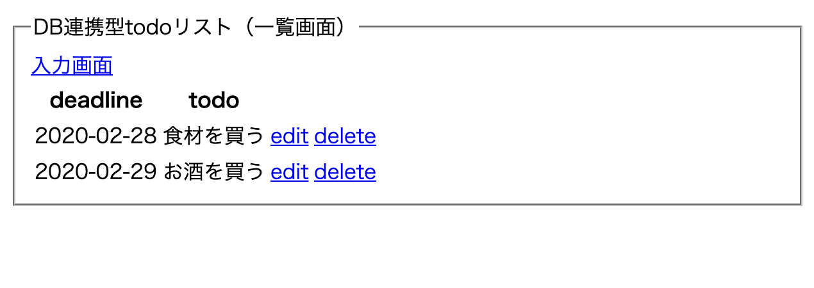
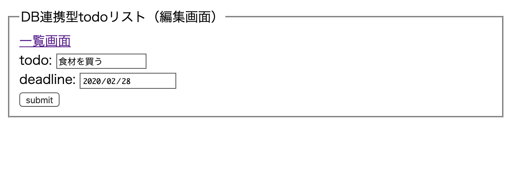
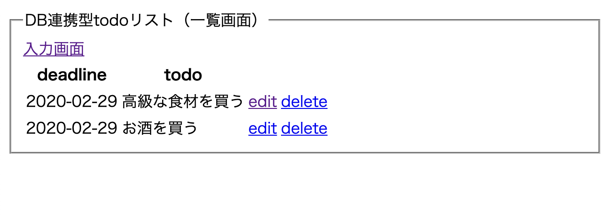
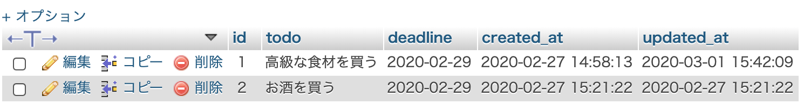
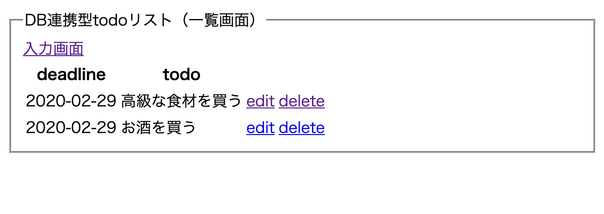
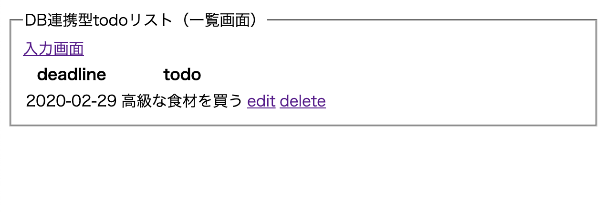

# PHP day3

- DB連携型todoリストの実装（登録済みデータの更新 / 登録済みデータの削除）

## 本日のゴール

- 共通して使用する処理を関数として専用ファイルに記述することで，必要なファイルから呼び出すことができる．
- 登録済みデータを編集し，更新できる．
- 登録済みの不要なデータを削除できる．

## 0. contents
1. 関数ファイルでの関数定義&実行（`functions.php`, `todo_create.php`，`todo_read.php`）
2. 登録済みデータ編集画面の実装（`todo_edit.php`）
3. 登録済みデータ更新処理の実装（`todo_update.php`）
3. 登録済みデータ削除処理の実装（`todo_delete.php`）

## 1. 関数ファイルでの関数定義&実行

### 1.1 ゴール
- 関数ファイルにDB接続処理を実行する関数を定義．
- `todo_create.php`と`todo_read.php`で上記関数を実行し，DB接続処理を行う．
- 動作自体はこれまでと同様にデータ登録と一覧表示ができれば完了．

### 1.2 やること
- `todo_create.php`で記述しているDB接続処理を`functions.php`にコピー．
- 関数の戻り値を設定．
- `todo_create.php`と`todo_read.php`で定義した関数を呼び出して実行する．

※これまで同様の動作が確認できればOK．

### 1.3 必要な実装
- `functions.php`に`connect_to_db()`関数を定義する．
- `todo_create.php`ファイルからDB接続処理をコピーし，`functions.php`の`connect_to_db()`内に記述する．
- `connect_to_db()`関数の戻り値を設定する．

`functions.php`の`connect_to_db()`関数は以下のようになる．
```php
// functions.php
function connect_to_db()
{
  $dbn = 'mysql:dbname=gsacf_x00_00;charset=utf8;port=3306;host=localhost';
  $user = 'root';
  $pwd = '';

  try {
    // 戻り値を設定する．下記のように記述すると，`todo_create.php`などで`$pdo=connect_to_db()`のように記述できる．
    return new PDO($dbn, $user, $pwd);
  } catch (PDOException $e) {
    // DB接続に失敗した場合はここでエラーを出力し，以降の処理を中止する
    echo json_encode(["db error" => "{$e->getMessage()}"]);
    exit();
  }
}
```

- `todo_create.php`と`todo_read.php`に関数ファイルを呼び出す処理を記述．
- 記述した関数を実行する．

```php
// todo_create.php
<?php
// 関数ファイルの読み込み
include('functions.php');
// ...
// 以下のDB接続処理を削除
// $dbn = 'mysql:dbname=gsacf_x00_00;charset=utf8;port=3306;host=localhost';
// $user = 'root';
// $pwd = '';

// try {
//   $pdo = new PDO($dbn, $user, $pwd);
// } catch (PDOException $e) {
//   echo json_encode(["db error" => "{$e->getMessage()}"]);
//   exit();
// }

// 定義したDB接続関数を実行
$pdo = connect_to_db();
```

### 1.4 動作確認

- これまで通り，入力した情報の登録と一覧表示がどうさすればOK．


## 2. 登録済みデータ編集画面の実装

### 2.1 ゴール
- `todo_read.php`に編集リンクと削除リンクを表示．
- 編集したいデータの編集リンクをクリックすると，編集画面（`todo_edit.php`）に移動する．
- 編集画面では，`input`タグに現在登録されているデータが自動的に表示される．

### 2.2 やること
- 一覧データ表示時にリンクを追加&リンク先の設定．
- 編集画面（`todo_edit.php`）の作成．
- 現在登録されているデータを編集画面の`input`タグに追加．

### 2.3 必要な実装
- `todo_read.php`でのデータ作成時に編集画面に移動する`<a>`タグを追加．

```php
// todo_read.php
// ...
  // 一覧データの出力部分に追記
  foreach ($result as $record) {
    $output .= "<tr>";
    $output .= "<td>{$record["deadline"]}</td>";
    $output .= "<td>{$record["todo"]}</td>";
    // edit deleteリンクを追加
    // <a>の中に`?name=value`の形で記述することでGETで値を送信することができる
    $output .= "<td><a href='todo_edit.php?id={$record["id"]}'>edit</a></td>";
    $output .= "<td><a href='todo_delete.php?id={$record["id"]}'>delete</a></td>";
    $output .= "</tr>";
  }
// ...
```

- 編集画面（`todo_edit.php`）でDBからid指定で該当する情報を取得．

```php
// 関数ファイルの読み込み
include("functions.php");

$id = $_GET["id"];

// DB接続
$pdo = connect_to_db();

// データ取得SQL作成
$sql = 'SELECT * FROM todo_table WHERE id=:id';

// SQL準備&実行
$stmt = $pdo->prepare($sql);
$stmt->bindValue(':id', $id, PDO::PARAM_INT);
$status = $stmt->execute();

// データ登録処理後
if ($status == false) {
  $error = $stmt->errorInfo();
  echo json_encode(["error_msg" => "{$error[2]}"]);
  exit();
} else {
  // 正常にSQLが実行された場合はid指定した1レコードを取得
  // fetch()関数でSQLで取得したレコードを取得できる
  $record = $stmt->fetch(PDO::FETCH_ASSOC);
}
// ...
```

- 取得した情報を`input`タグに表示させる．
- `<input>`のvalueにデータを追加することで，初期値を設定できる．
- idの情報がないと次のステップでデータの更新ができないため，`<input type="hidden">`を使用して送信する．

```html
<!-- todo_edit.php -->
<!-- ... -->
  <form action="todo_update.php" method="POST">
    <fieldset>
      <legend>DB連携型todoリスト（編集画面）</legend>
      <a href="todo_read.php">一覧画面</a>
      <div>
        todo: <input type="text" name="todo" value="<?= $record["todo"] ?>">
      </div>
      <div>
        deadline: <input type="date" name="deadline" value="<?= $record["deadline"] ?>">
      </div>
      <div>
        <button>submit</button>
      </div>
      <input type="hidden" name="id" value="<?= $record["id"] ?>">
    </fieldset>
  </form>
<!-- ... -->
```

### 2.4 動作確認

- 一覧画面（`todo_read.php`）で編集と削除のリンクが表示される．



- editのリンクをクリックすると編集画面に移動し，該当するデータが`<input>`内に表示される．




## 3. 登録済みデータ更新処理の実装

### 3.1 ゴール
- 編集画面（`todo_edit.php`）で情報を編集後，送信ボタンをクリックするとDBの情報が上書きされて更新される．

### 3.2 やること
- 更新ファイル（`todo_update.php`）でデータを受け取る．
- DBに接続し，`UPDATE`文を実行する．
- 更新が成功したら一覧画面（`todo_read.php`）に移動する．

### 3.3 必要な実装
- `$_POST`でデータを受け取る．
- DBに接続する．

```php
// todo_update.php
// 関数ファイルの読み込み
include("functions.php");

// 送信データ受け取り
$todo = $_POST["todo"];
$deadline = $_POST["deadline"];
$id = $_POST["id"];

// DB接続
$pdo = connect_to_db();
// ...
```

- id指定してからデータを更新するSQL文を作成し，実行する．

```php
// todo_update.php
// ...
// UPDATE文を作成&実行
// 必ず`WHERE`でid指定す（しないと全レコードが更新される）
$sql = "UPDATE todo_table SET todo=:todo, deadline=:deadline, updated_at=sysdate() WHERE id=:id";

$stmt = $pdo->prepare($sql);
$stmt->bindValue(':todo', $todo, PDO::PARAM_STR);
$stmt->bindValue(':deadline', $deadline, PDO::PARAM_STR);
$stmt->bindValue(':id', $id, PDO::PARAM_INT);
$status = $stmt->execute();
// ...
```

- 正常に実行された場合は一覧画面（`todo_read.php`）に移動する．

```php
// todo_update.php
// ...
// データ登録処理後
if ($status == false) {
  // SQL実行に失敗した場合はここでエラーを出力し，以降の処理を中止する
  $error = $stmt->errorInfo();
  echo json_encode(["error_msg" => "{$error[2]}"]);
  exit();
} else {
  // 正常にSQLが実行された場合は一覧ページファイルに移動し，一覧ページの処理を実行する
  header("Location:todo_read.php");
  exit();
}
```

### 3.4 動作確認

- `todo_edit.php`でデータを編集&送信し，一覧画面でデータが更新されていればOK．



- 一応`phpmyadmin`にアクセスし，データが更新されている旨を確認する．




## 4. 登録済みデータ削除処理の実装

### 4.1 ゴール
- 一覧画面で削除リンクをクリックすると該当するデータが削除される．

### 4.2 やること
- 削除ファイル（`todo_delete.php`）でデータを受け取る．
- DBに接続し，`DELETE`文を実行する．
- 更新が成功したら一覧画面（`todo_read.php`）に移動する．

### 4.3 必要な実装
- `$_GET`でデータを受け取る．
- DBに接続する．

```php
// todo_delete.php
// 関数ファイルの読み込み
include("functions.php");

// 送信データ受け取り
$id = $_GET["id"];

// DB接続
$pdo = connect_to_db();
// ...
```

- id指定してからデータを削除するSQL文を作成し，実行する．

```php
// todo_update.php
// ...
// DELETE文を作成&実行
// 必ず`WHERE`でid指定す（しないと全レコードが削除される）
$sql = "DELETE FROM todo_table WHERE id=:id";

$stmt = $pdo->prepare($sql);
$stmt->bindValue(':id', $id, PDO::PARAM_INT);
$status = $stmt->execute();
// ...
```

- 正常に実行された場合は一覧画面（`todo_read.php`）に移動する．

```php
// todo_update.php
// ...
// データ登録処理後
if ($status == false) {
  // SQL実行に失敗した場合はここでエラーを出力し，以降の処理を中止する
  $error = $stmt->errorInfo();
  echo json_encode(["error_msg" => "{$error[2]}"]);
  exit();
} else {
  // 正常にSQLが実行された場合は一覧ページファイルに移動し，一覧ページの処理を実行する
  header("Location:todo_read.php");
  exit();
}
```

### 4.4 動作確認
- 一覧画面で削除リンクをクリックすると．．．



- データが削除される！




今回はここまで( `･ω･)b

### チャレンジ！
- 前回の実装に更新と削除の処理を追加．
- 既存サービスのコピー実装．

### 次回
- session機能の実装
- ユーザ管理 / 認証

